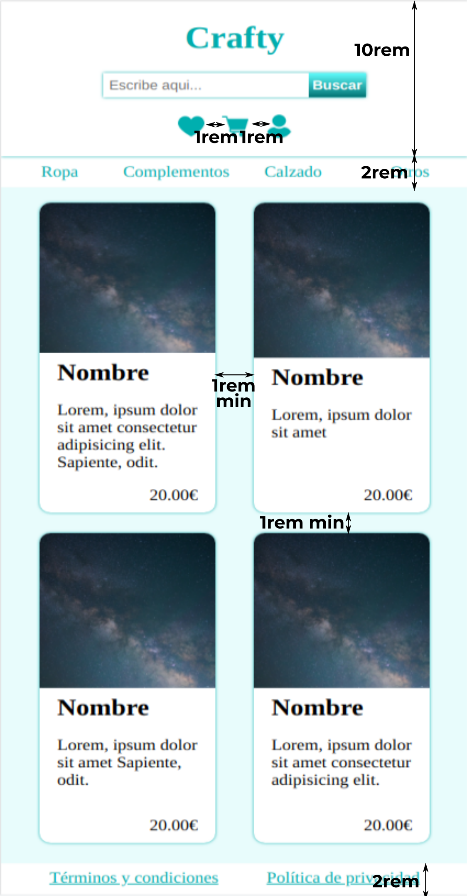

# Layout

Edita el archivo style.css para crear un layout responsive como el de las imágenes:

Usa grid para maquetar el layout general de la página (body) y flex para los elementos (header, menús, main, articles...)

Ten en cuenta que en un proyecto real la cantidad de elementos dependerá de los resultados de búsqueda, y debe verse correctamente haya uno o varios (el footer no debe subir por falta de contenido). Para comprobarlo, comenta y descomenta los articles del html.

Puedes ver cómo debería funcionar en este video:

Para ahorrar tiempo, solo tendrás que encargarte de las propiedades relacionadas con flex y grid; todo lo demás se incluye en el archivo base.css que está importado en el style.css.

Por favor, **NO MODIFIQUES EL HTML NI EL ARCHIVO BASE.CSS**. Si nececitas cambiar algo del CSS, utiliza la cascada y la especificidad para sobreescribirlo en el style.css.

El resultado final debe funcionar correctamente ejecutándolo con live server y no dar ningún error en el [Validador de CSS de la W3](https://jigsaw.w3.org/css-validator/#validate_by_input)
